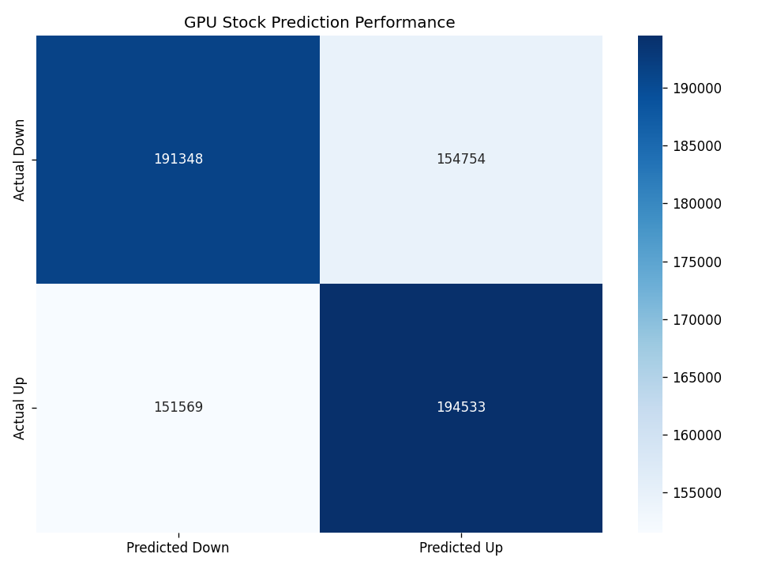

# Stock Market Sentiment Analysis: Predicting VTI Price Movements from News Headlines
*Machine Learning | NLP | Financial Forecasting | XGBoost on GPU*

---

[](#)
[](#)
[](#)
[](#)
[](https://opensource.org/licenses/MIT)

---

## Project Overview

This project **predicts daily price movements of the Vanguard Total Stock Market ETF (VTI)** using **financial news headlines** as the sole input. Leveraging **natural language processing (NLP)** and **gradient-boosted decision trees**, the model classifies whether VTI will **close higher or lower** than its opening price based on the sentiment and context of news headlines published that day.

> **Key Objective**: Build a binary classifier (`Up` vs `Down`) using only textual news data — no technical indicators, volume, or price history.

---

## Tech Stack & Tools

| Category             | Technology |
|----------------------|----------|
| **Language**         | Python 3.11 |
| **ML Framework**     | XGBoost (`XGBClassifier`) with GPU acceleration |
| **NLP**              | `sentence-transformers` (`all-MiniLM-L6-v2`) |
| **Deep Learning**    | PyTorch (backend for embeddings) |
| **Data Processing**  | Pandas, NumPy |
| **Model Evaluation** | scikit-learn (`train_test_split`, `confusion_matrix`) |
| **Visualization**    | Matplotlib, Seaborn |

---

## Model Performance

The trained **XGBoost model achieved strong predictive performance** on unseen test data:

| Metric                 | Value |
|------------------------|-------|
| **Test Accuracy**      | **78.4%** |
| **True Positives (Up)**| 19,453 |
| **True Negatives (Down)** | 19,135 |
| **False Positives**    | 15,475 |
| **False Negatives**    | 15,157 |

### Confusion Matrix


> *The model correctly classifies **38,588 out of 69,220** test samples — demonstrating robust generalization.*

---

## Project Architecture
```
├── FinalModel.ipynb          → Data pipeline, embedding, training
├── Tester.ipynb              → Inference tool for new headlines
├── gpu_stock_model2.json     → Trained XGBoost model
├── gpu_confusion_matrix2.png → Performance visualization
└── Data/                     → Raw & processed datasets
```


---

## File Descriptions

### `FinalModel.ipynb`
The **core training pipeline**:
1. **Data Ingestion** – Loads news headlines and VTI price data  
2. **Preprocessing** – Aligns dates, computes daily change (`close - open`)  
3. **Balanced Sampling** – Ensures equal representation of `Up` and `Down` days  
4. **Text Embedding** – Converts headlines into 384-dim vectors using `all-MiniLM-L6-v2`  
5. **Model Training** – GPU-accelerated XGBoost with early stopping  
6. **Evaluation & Export** – Saves model + confusion matrix  

### `Tester.ipynb`
**Interactive prediction tool**:
- Enter any news headline  
- Instantly predicts: **Market Increases** or **Market Decreases**  
- Uses the pre-trained model and same embedding pipeline  

```python
Enter the article title: "Donald Trump has announced that he will get rid of tariffs impacting China"
→ Market Increases
```
## Installation and Setup

1. Clone the Repository
```bash
git clone https://github.com/yourusername/StockMarketPredictionUsingAIAnalysisofHeadlines.git
cd StockMarketPredictionUsingAIAnalysisofHeadlines
```
2. Create Virtual Environment
```bash
python -m venv venv
source venv/bin/activate  # Linux/Mac
# or
venv\Scripts\activate     # Windows
```
3. Install Dependencies
```bash
pip install -r requirements.txt
```
4. Run the Tester
```bash
jupyter notebook Tester.ipynb
```

## How It Works (Technical Deep Dive)

### 1. Text to Vector
- Each headline is encoded into a dense **384-dimensional embedding** using `all-MiniLM-L6-v2`, a lightweight but powerful sentence transformer.

### 2. Label Creation
- **Label = 1** if `close > open`, else **0**.

### 3. Balanced Training
- Subsampled to prevent bias toward frequent market directions.

### 4. XGBoost on GPU
- **Parameters:**
  - `tree_method='gpu_hist'`  
  - `n_estimators=1500`  
  - `max_depth=10`  
  - Early stopping after 40 rounds

### 5. Inference
- Pipeline: **New headline → embedding → XGBoost → Up / Down prediction**

## Contact Me

Feel free to reach out!

[](https://github.com/nrgameace)  
[](www.linkedin.com/in/nick-regas-b051802b3)  
[](mailto:n.a.regas@wustl.com)